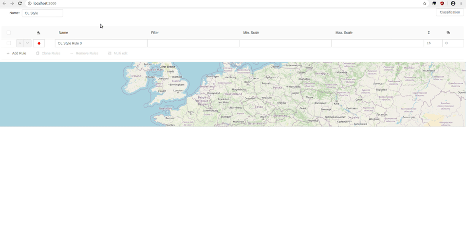

# {{site.data.vars.workshopName}}

Welcome to the **{{ site.data.vars.workshopName }}**. This workshop will give you a first overview
of the GeoStyler, a web-based tool for interactive styling of geographic data.

In this workshop, we will create a basic application that allows users to style geographic data via a graphical user interface.

The final application will look like this:

<!-- TODO replace gif with new one -->

## Overview

In this workshop we will get to know the three core elements of GeoStyler. No previous knowledge regarding GeoStyler is needed.

- [Style Parsers](#style-parsers-readme) - Translator entities that allow the usage of (nearly) any styling format
- [UI Components](#ui-components-readme) - Graphical components to interactively edit styles
- [Data Parsers](#data-parsers-readme) - Translator entities that allow the usage of geodata

Every section is based on the results of the previous ones. So it makes sense to go through the workshop from start
to end, if you do this workshop for the first time.

## Setup

The following instructions and exercises require some already installed programs on your computer.
Please make sure that the following programs are installed:

- A usable text editor, e.g. [VSCode](https://code.visualstudio.com/).
- [NodeJS](https://nodejs.org/en/) in version 16.

## Authors



- {{ author.name }} ([{{ author.mail }}](mailto:{{ author.mail }}))
  
