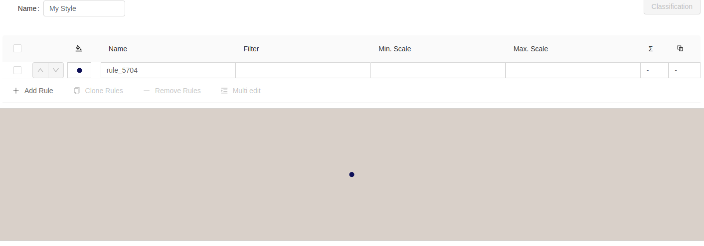

# PreviewMap Komponente

Die `PreviewMap` Komponente stellt den erzeugten Stil in einer Karte dar.

Dazu erwartet die Komponente ein `style` Property, das den entsprechenden GeoStyler Stil enthält.

Um Zugriff zu dem Stil in der `Style` Komponente zu bekommen, nutzen wir die `onStyleChange` Methode
der Komponente und speichern den Stil in einer State-Variablen.

```js
import React, { useState } from 'react';
import { Style } from 'geostyler';

import 'antd/dist/antd.css';

function App() {

  const [style, setStyle] = useState();

  return (
    <div>
        <Style
          compact={true}
          onStyleChange={(newStyle) => {setStyle(newStyle)}}
        />
    </div>
  );
}

export default App;
```

Danach können wir die `PreviewMap` Komponente importieren

```js
import { PreviewMap } from 'geostyler';
```

und die Komponente der Applikation hinzufügen

```js
import React, { useState } from 'react';
import { Style, PreviewMap } from 'geostyler';

import 'antd/dist/antd.css';

function App() {

  const [style, setStyle] = useState();

  return (
    <div>
        <Style
          compact={true}
          onStyleChange={(newStyle) => {setStyle(newStyle)}}
        />
        {
          style && (
            <PreviewMap
              style={style}
            />
          )
        }
    </div>
  );
}

export default App;
```

Anschließend sollte die Applikation folgendermaßen aussehen

[](../images/previewMap.png)
